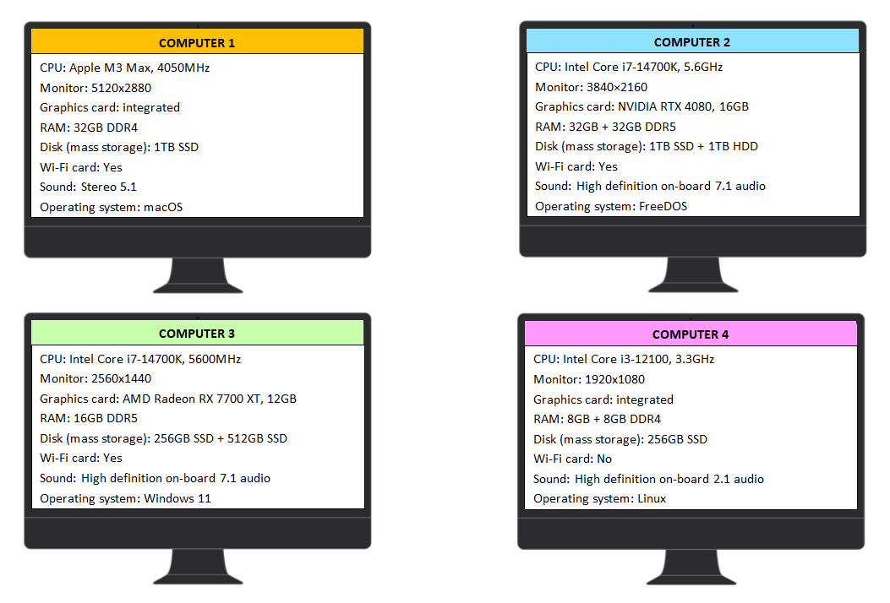

# Qüestionari: configuració de l'ordinador



```{mchoice}
:answer1: 1;
:answer2: 2;
:answer3: 3;
:answer4: 4;
:correct: 4

Mirant el processador, la memòria RAM i la tarjeta gràfica, quin ordinador seria el més feble?
```

```{mchoice}
:answer1: 1;
:answer2: 2;
:answer3: 3;
:answer4: 4;
:correct: 2

Mirant el processador, la memòria RAM i la tarjeta gràfica, quin ordinador seria el més potent?
```

```{mchoice}
:answer1: 1;
:answer2: 2;
:answer3: 3;
:answer4: 4;
:correct: 1

Quin monitor té la millor resolució?
```

```{mchoice}
:answer1: 1;
:answer2: 2;
:answer3: 3;
:answer4: 4;
:correct: 2

Quin ordinador té més memòria RAM?
```

```{mchoice}
:answer1: 1;
:answer2: 2;
:answer3: 3;
:answer4: 4;
:correct: 4

Quin ordinador ofereix la pitjor qualitat de so?
```

```{mchoice}
:answer1: 1;
:answer2: 2;
:answer3: 3;
:answer4: 4;
:correct: 2,3

Quin ordinador té el processador més ràpid?
```

```{mchoice}
:answer1: 1;
:answer2: 2;
:answer3: 3;
:answer4: 4;
:correct: 4

En quin ordinador es pot emmagatzemar menys dades?
```

```{mchoice}
:answer1: 1;
:answer2: 2;
:answer3: 3;
:answer4: 4;
:correct: 2

Quin ordinador té la millor combinació de discos per emmagatzemar gran quantitat de dades?
```

```{mchoice}
:answer1: 1;
:answer2: 2;
:answer3: 3;
:answer4: 4;
:correct: 4

Quin ordinador no es pot connectar a una xarxa sense fil?
```

```{mchoice}
:answer1: 1;
:answer2: 2;
:answer3: 3;
:answer4: 4;
:correct: 3

En quin ordinador hi ha un sistema operatiu Microsoft?
```