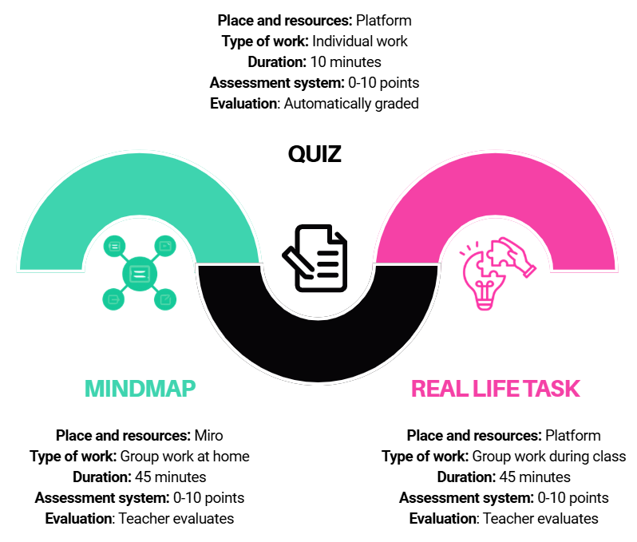

# Estructura de la lliçó

**Aquesta lliçó té tres components:**



Al final de la sessió de classe s'avaluarà cada part del vostre treball:

- **Creació del mapa mental** – estructura, contingut, claredat de la presentació i col·laboració en grup (10 punts)

- **Tasca individual** – precisió de les respostes i comprensió del contingut en el qüestionari (10 punts)

- **Treball en grup** – contribució al treball en equip, argumentació d'idees i participació en la discussió (10 punts)


| Qualificació final|Punts|
| ------------------|------|
| Excel·lent (5)|27–30|
| Molt bé (4)|23–26|
| Bé (3)|19–22|
| Suficient (2)|15–18|
| Insuficient (1) |0–14|


```{suggestionnote} 
La vostra qualificació final no dependrà només del coneixement, sinó de la manera en què participeu en el treball, col·laboreu amb altres i contribuïu a una atmosfera de treball positiva dins de l'equip. Per tal que el treball en equip sigui reeixit, és important seguir les següents regles de col·laboració:
- 	Tots els membres de l'equip tenen igual valor i els tractem amb respecte.
- 	Mantenim una atmosfera constructiva i positiva, fins i tot quan tenim opinions diferents.
- 	Cada membre assumeix responsabilitat per la seva contribució i pel resultat conjunt de l'equip.
- 	Animem tots els membres a participar activament en la resolució de tasques.
- 	En la presa de decisions intentem incloure tots els membres de l'equip.
- 	Considerem diferents idees i triem la solució que millor s'adapta a la tasca.
- 	Desenvolupo idees conjuntament, en discutim i creem solucions finals.
- 	Utilitzem el temps responsablement per completar la tasca en el termini previst.
- 	Seguim el progrés del grup i acordem els passos següents.
```

A la pàgina següent trobaràs instruccions per crear un mapa mental.